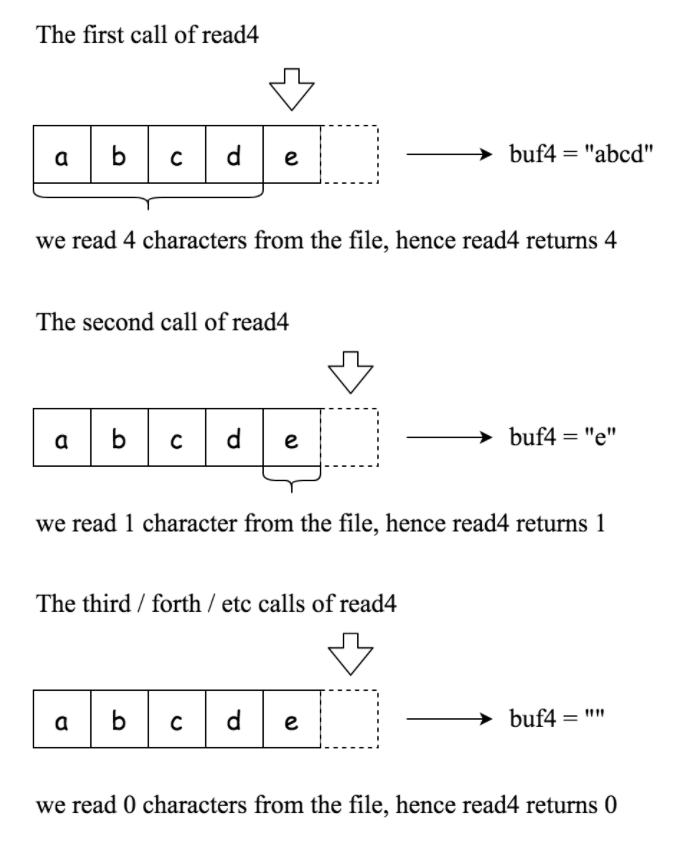

# [157. Read N Characters Given Read4](https://leetcode.com/problems/read-n-characters-given-read4/)

- Easy
- Given a file and assume that you can only read the file using a given method read4, implement a method to read n characters.

Method read4:

The API read4 reads 4 consecutive characters from the file, then writes those characters into the buffer array buf4.

The return value is the number of actual characters read.

Note that read4() has its own file pointer, much like FILE *fp in C.

Definition of read4:

```
Parameter:  char[] buf4
Returns:    int
```

Note: buf4[] is destination not source, the results from read4 will be copied to buf4[]
Below is a high level example of how read4 works:



```
File file("abcde"); // File is "abcde", initially file pointer (fp) points to 'a'
char[] buf4 = new char[4]; // Create buffer with enough space to store characters
read4(buf4); // read4 returns 4. Now buf4 = "abcd", fp points to 'e'
read4(buf4); // read4 returns 1. Now buf4 = "e", fp points to end of file
read4(buf4); // read4 returns 0. Now buf4 = "", fp points to end of file
```
 

Method read:

By using the read4 method, implement the method read that reads n characters from the file and store it in the buffer array buf. Consider that you cannot manipulate the file directly.

The return value is the number of actual characters read.

Definition of read:
```
    Parameters:	char[] buf, int n
    Returns:	int

Note: buf[] is destination not source, you will need to write the results to buf[]
 ```

Example 1:
```
Input: file = "abc", n = 4
Output: 3
Explanation: After calling your read method, buf should contain "abc". We read a total of 3 characters from the file, so return 3. Note that "abc" is the file's content, not buf. buf is the destination buffer that you will have to write the results to.
```

Example 2:
```
Input: file = "abcde", n = 5
Output: 5
Explanation: After calling your read method, buf should contain "abcde". We read a total of 5 characters from the file, so return 5.
```
Example 3:
```
Input: file = "abcdABCD1234", n = 12
Output: 12
Explanation: After calling your read method, buf should contain "abcdABCD1234". We read a total of 12 characters from the file, so return 12.
```
Example 4:
```
Input: file = "leetcode", n = 5
Output: 5
Explanation: After calling your read method, buf should contain "leetc". We read a total of 5 characters from the file, so return 5.
```

Note:

- Consider that you cannot manipulate the file directly, the file is only accesible for read4 but not for read.
- The read function will only be called once for each test case.
- You may assume the destination buffer array, buf, is guaranteed to have enough space for storing n characters.
